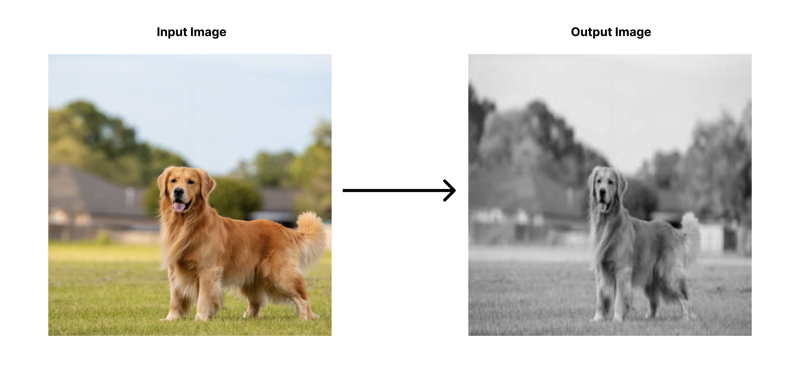

# Udagram Image Filtering Microservice

Udaram Image Filtering Microservice takes an image url from user & returns a processed version of it. Service can be consumed via REST endpoint described below:

| Sno  | Endpoint                                                     | Description                                               |
| ---- | ------------------------------------------------------------ | --------------------------------------------------------- |
| 1    | http://image-filter-project-dev.ap-south-1.elasticbeanstalk.com/filteredimage?image_url=<image.jpeg> | Pass valid url of image at end in place of `<image.jpeg>` |

> No image is stored on the server, it is deleted as soon as processed version of image is delivered to the requesting client.

### Overview

### Setup For Development

You'll need to create a new node server. Open a new terminal within the project directory and run:

1. Initialize a new project: `npm i`
2. run the development server with `npm run dev`

### Contribution

1. All contributions has to be submitted in the form of pull request to `development` branch.
